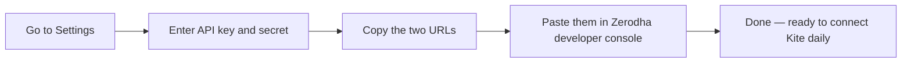

# Getting Started

LaxGan is a personal trading assistant that connects to your Zerodha account, watches the market, and places trades automatically based on a strategy you choose.

You are in full control at all times — you pick the strategy, you start it, and you can stop it with one click.

---

## Before you can do anything

You need two things to use LaxGan:

1. **A Zerodha account** with Kite Connect API access enabled. You get this by subscribing to the Kite Connect API on the Zerodha developer portal (~₹2000/month).

2. **Your API key and secret** from that developer portal. Think of these like a username and password that let LaxGan talk to your Zerodha account.

Without these two, the dashboard will open but nothing will work.

---

## First-time setup (do this once)

1. Open **Settings** from the top navigation bar.
2. Paste your Zerodha API key and secret into the first section and hit **Save**.
3. Scroll down — you'll see two URLs: **Redirect URL** and **Postback URL**.
4. Copy both URLs and paste them into your app's settings on the Zerodha developer portal.

That's the one-time setup. After that, you just log into Kite each morning.

---

## Every morning before the market opens

Zerodha issues a fresh login every day — your session expires at midnight. Each morning:

1. Click the badge in the **top-right corner** of the dashboard (it shows "Not connected" when you need to log in).
2. You'll be taken to the Zerodha Kite login page.
3. Log in with your Zerodha credentials.
4. The dashboard redirects back automatically and the badge turns green with your user ID.

You must do this before starting the engine.

---

## What each page does

| Page | What it's for |
|---|---|
| **Dashboard** | Start and monitor live trades. This is where you spend most of your time. |
| **Orders** | Browse your complete trade history, search past trades, export to CSV. |
| **Analytics** | Charts showing your equity growth, win rate, and risk metrics over time. |
| **Backtest** | Test a strategy on past market data before risking real money. |
| **Settings** | Connect your Zerodha account and set up Telegram notifications. |
| **Docs** | This guide. |
