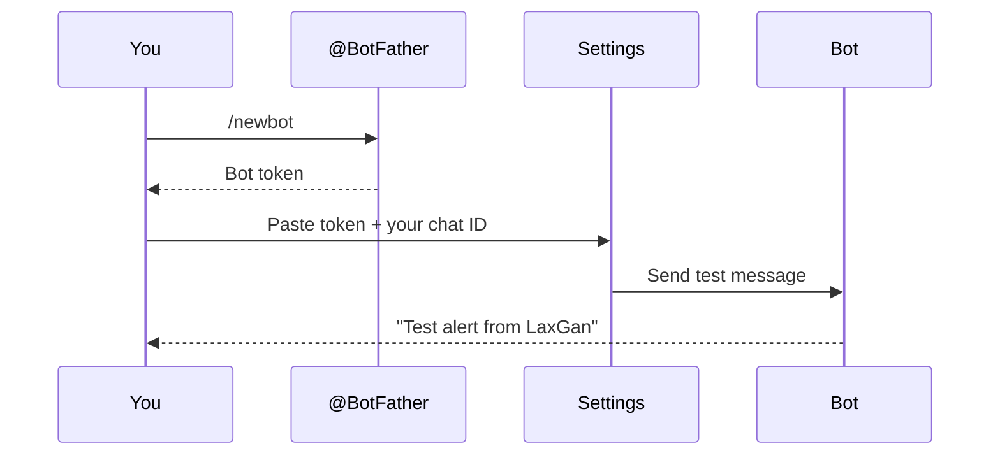

# Settings

The Settings page has three sections. Here's what each one does and what you unlock by filling it in.

---

## 1. Zerodha API credentials

**What this unlocks:** Everything. Without your API key and secret, the dashboard cannot connect to Zerodha at all — no market data, no orders, no Kite login.

**What to fill in:**

- **API key** — A short string of letters and numbers. You can see it in the Zerodha developer portal under your app. It's safe to view and share with the dashboard.
- **API secret** — Like a password for your API key. Once you save it, the dashboard shows a green "Secret is set" badge but never shows the value again. If you need to update it, just type the new one and save.

**Where to get these:** Log in at `developers.kite.trade`, open your app, and you'll find both under "App credentials."

> The API secret field shows as blank even after saving — this is intentional. The dashboard stores it securely and only shows whether it's been set or not. You only need to enter it again if you're rotating to a new secret.

---

## 2. Kite developer console URLs

**What this unlocks:** The ability for Zerodha to send you back to the dashboard after you log in, and the ability for Zerodha to notify the engine when your orders are filled.

This section doesn't ask you to type anything — it shows two pre-generated URLs that you need to copy and paste into your app's settings on the Zerodha developer portal.

**Redirect URL** — After you click "Login to Kite" in the dashboard, Zerodha redirects you back here to complete the connection. If this URL isn't set correctly in the developer portal, the login flow will fail.

**Postback URL** — When an order is filled on Zerodha's side, Zerodha sends a notification to this URL so the engine knows immediately. Without it, the engine still works but relies on polling (checking periodically) instead of instant notification.

**How to set them:**
1. Click **Copy** next to each URL.
2. Go to `developers.kite.trade` → your app → Edit.
3. Paste the Redirect URL into the "Redirect URL" field.
4. Paste the Postback URL into the "Postback URL" field.
5. Save the app settings on Zerodha's side.

You only need to do this once.

---

## 3. Telegram alerts

**What this unlocks:** Notifications sent to your phone or a Telegram group whenever something important happens — a trade opens, a trade closes, the daily loss limit is hit, or the engine stops.

Without this section filled in, the engine still works — you just won't get notifications outside the dashboard.

**What to fill in:**

- **Bot token** — A token you get by creating a Telegram bot. Create one by messaging `@BotFather` on Telegram, following the prompts, and copying the token it gives you. Like the API secret, once saved it shows as "Token is set" and is never displayed again.
- **Chat ID** — The ID of the chat where alerts should be sent. This can be your personal Telegram chat or a group. The easiest way to find your personal ID is to message `@userinfobot` on Telegram — it will reply with your ID.

**Testing before saving:** You can click **Send test** after filling in both fields (even before saving) to check that the bot can actually reach you. If the test succeeds, you'll see a message arrive in your Telegram chat.

**How to find a group chat ID:** Add `@userinfobot` to the group, type `/start`, and it will reply with the group's ID (it starts with a minus sign, e.g. `-1001234567890`).
